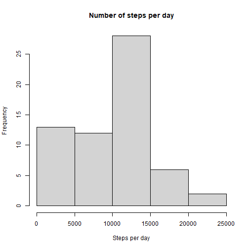
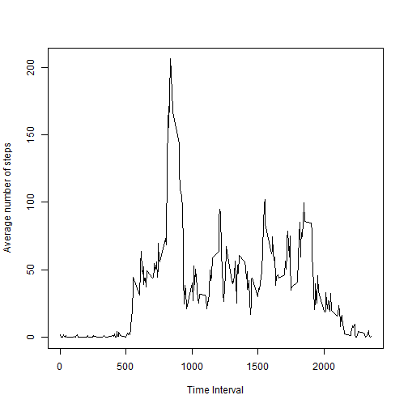
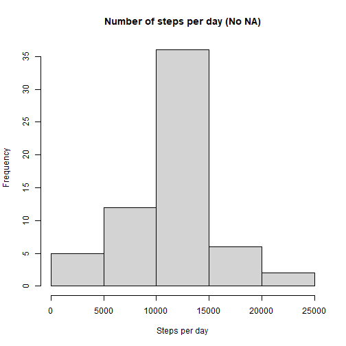
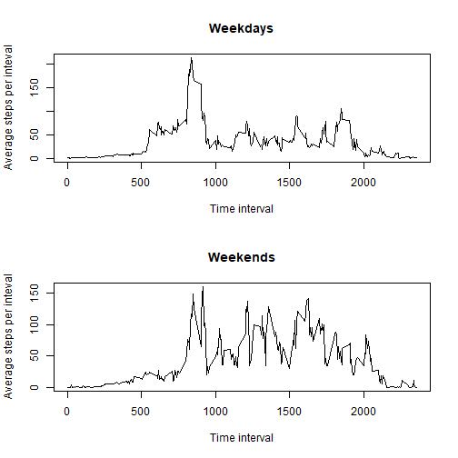

## Loading and preprocessing the data

First of all, we need to load the data. We assume the working directory to contain the zip file 'activity.zip' which contains the data for our project. We load the data and transform the class of the date variable.


```r
df <- read.csv(unz('activity.zip', 'activity.csv'))
df$date <- as.Date(df$date, '%Y-%m-%d')
```

## What is mean total number of steps taken per day?

We next calculate the total number of steps taken each day, ignoring missing values. To this end, we just apply the tapply function. We then plot a histogram of the calculation.


```r
tot_day <- tapply(df$steps, df$date, sum, na.rm=TRUE)
hist(as.numeric(tot_day), xlab='Steps per day', ylab='Frequency', main='Number of steps per day')
```



We then calculate the mean and the median of the number of steps per day with the following code


```r
med <- as.integer(median(as.numeric(tot_day)))
m <- mean(as.numeric(tot_day))
```

we obtain the value 10395 for the **median** and the value of 9354.2295082 for the **mean**.


## What is the average daily activity pattern?

We compute the average number of steps per interval, and then we make a time series plot. On the *x-axis* we have the time interval, on the *y-axis* we have the average number of steps in the time inteval, averaged over all days.


```r
avg_int <- tapply(df$steps, df$interval, mean, na.rm=TRUE)
plot(unique(df$interval), as.numeric(avg_int), type='l', xlab='Time Interval', ylab='Average number of steps')
```



We then calculate the time interval in which the highest average value of steps is registered.


```r
df$interval[which.max(as.numeric(avg_int))]
```

```
## [1] 835
```

## Imputing missing values

We calculate the number of missing values.


```r
sum(is.na(df$steps))
```

```
## [1] 2304
```

We replace missing values by the average number of steps in the corresponding time inverval.


```r
library(dplyr)
df$interval <- as.integer((df$interval))
interval_minutes <- 0.6*(df$interval - df$interval %% 100) + df$interval %% 100
dfNoNa <- df %>% mutate(steps = ifelse(is.na(steps), avg_int[interval_minutes / 5], steps))
tot_dayNoNa <- tapply(dfNoNa$steps, dfNoNa$date, sum, na.rm=TRUE)
hist(as.numeric(tot_dayNoNa), xlab='Steps per day', ylab='Frequency', main='Number of steps per day (No NA)')
```



and we calculate the corresponding mean and median


```r
as.integer(median(as.numeric(tot_dayNoNa)))
```

```
## [1] 10765
```

```r
mean(as.numeric(tot_dayNoNa))
```

```
## [1] 10766.13
```
From which we see that, with our replacement, both the value of the **median** and the value of **mean** have *increased*. Imputing missing values has increased median and mean.


## Are there differences in activity patterns between weekdays and weekends?

We construct the panel plot distinguishing between weekdays and weekends.


```r
Sys.setlocale("LC_TIME", "C")
```

```
## [1] "C"
```

```r
week <- c('Monday', 'Tuesday', 'Wednesday', 'Thursday','Friday')
dfNoNa <- dfNoNa %>% mutate(weekday = factor(weekdays(date) %in% week, c(T,F), labels=c('weekday', 'weekend')))
df_wd <- subset(dfNoNa, weekday == 'weekday')
df_we <- subset(dfNoNa, weekday == 'weekend')
avg_WD <- tapply(df_wd$steps, df_wd$interval, mean, na.rm=TRUE)
avg_WE <- tapply(df_we$steps, df_we$interval, mean, na.rm=TRUE)
par(mfrow=c(2,1))
plot(unique(df_wd$interval), as.numeric(avg_WD), type='l', xlab='Time interval', ylab='Average steps per inteval', main='Weekdays')
plot(unique(df_we$interval), as.numeric(avg_WE), type='l', xlab='Time interval', ylab='Average steps per inteval', main='Weekends')
```



It is evident that on weekends the average number of steps in the second part of the day has increased with respect to the same time interval on weekdays.

